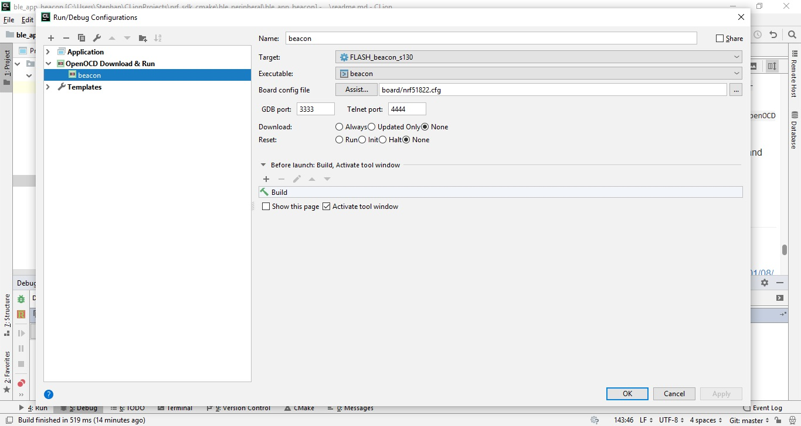

# cmake-nRF5x

Cmake script for projects targeting Nordic Semiconductor nRF5x series devices using the GCC toolchain from ARM.

# Hardware

This project may be use for custom nrf51822 boards. For flashing and debugging uses [ST-Link V2](https://www.aliexpress.com/item/ST-LINK-Stlink-ST-Link-V2-Mini-STM8-STM32-Simulator-Download-Programmer-Programming-with-Cover/32921831799.html) in-circuit debugger and programmer with SWD interface.

# Dependencies

The script makes use of the following tools:

- [nRF51 Software Development Kit 10.0.0](https://developer.nordicsemi.com/nRF5_SDK/nRF51_SDK_v10.x.x/doc/10.0.0/) - SoC specific drivers and libraries
- [nRF5 Command Line Tools](https://www.nordicsemi.com/Software-and-Tools/Development-Tools/nRF5-Command-Line-Tools) - contains util for merging hex files 
- [OpenOCD](http://openocd.org/) - open-source software tool for programming custom devices
- [arm-non-eabi-gcc by ARM and the GCC Team](https://developer.arm.com/open-source/gnu-toolchain/gnu-rm/downloads) - compiler toolchain for embedded (= bare metal) ARM chips
- [Clion](https://www.jetbrains.com/clion/) - cmake based IDE for cross-platform applications
- [using OpenOCD with CLion](https://habr.com/ru/post/345670/) - OpenOCD plugin for flushing & debugging ARM apps from CLion

# Setup

1. Place the CMake_nRF5x.cmake into the root of your project

2. Search the SDK `example` directory for a `nrf_drv_config.h` and a linker script (normally named `<project_name>_gcc_<chip familly>.ld`) that fits your chip and project needs.

3. Copy the `nrf_drv_config.h` into the root of your project. Modify it as required for you project.

4. Copy the linker script into the root of your project. Rename it to just `gcc_<chip familly>.ld` For example:
	
	```
	gcc_nrf51.ld
	```
5. Create a new `CMakeLists.txt` file at the same level. Add the project standard cmake project header

	```cmake
	cmake_minimum_required(VERSION 3.6)
	project(your_project_name C ASM)
	```
	_Note_: you can add `CXX` between `C ASM` to add c++ support
	
6. Set your target chip family and softdevice: `nRF51`, `s130`

	```cmake
	set(SOFTDEVICE "s130")
	set(NRF_TARGET "nrf51") 
	```

7. Set variables with paths to external dependencies:

	```cmake
	set(ARM_NONE_EABI_TOOLCHAIN_PATH "C:/Program Files (x86)/GNU Tools Arm Embedded/7 2018-q2-update")
    set(NRF5_SDK_PATH "C:/Users/Stephan/nRF51_SDK")
    set(MERGEHEX_PATH "C:/Program Files (x86)/Nordic Semiconductor/nrf5x/bin/mergehex")
	```
	
	_Optional_: You can put the above lines into a separate file (e.g. `CMake_nRF5x_settings.cmake`) and include it in the `CMakeLists.txt` file:

	```cmake 
	include("CMake_nRF5x_settings.cmake")
	```

8. Include this script so the "CMakeLists.txt" can use it

	```cmake
	include("CMake_nRF5x.cmake")
	```

9. Perform the base setup

	```cmake
	nRF5x_setup()
	```
	
10. Optionally add additional libraries:

	```cmake
	nRF5x_addAppFIFO()
	```
	_Note_: only the most common drivers and libraries are wrapped with cmake macros. If you need more, you can use `include_directories` and `list(APPEND SDK_SOURCE_FILES ...)` to add them. For example, in order to add the Bluetooth Battery Service:

	```cmake
	include_directories(
	        "${NRF5_SDK_PATH}/components/ble/ble_services/ble_bas"
	)
		
	list(APPEND SDK_SOURCE_FILES
	        "${NRF5_SDK_PATH}/components/ble/ble_services/ble_bas/ble_bas.c"
	        )
	```
	
11. Append you source files using `list(APPEND SOURCE_FILES ...)` and headers using `include_directories`. For example:

	```cmake
	include_directories(".")
	list(APPEND SOURCE_FILES "main.c")
	```

12. Finish setup by calling `nRF5x_addExecutable`

	```cmake
	nRF5x_addExecutable(${PROJECT_NAME} "${SOURCE_FILES}")
	```

# Build

After setup you can use cmake as usual:

1. Generate the actual build files (out-of-source builds are strongly recomended):

	```commandline
	cmake -H. -B"cmake-build" -G "Unix Makefiles"
	```

2. Build your app:

	```commandline
	cmake --build "cmake-build" --target <your project name>
	```

# Flash

In addition to the build target (named like your project) the script adds some support targets:

`FLASH_SOFTDEVICE` To flash a nRF softdevice to the SoC (typically done only once for each SoC)

```commandline
cmake --build "cmake-build" --target FLASH_SOFTDEVICE
```

`FLASH_<your project name>` To flash your application (note that hex writes in after-softdevice address)

```commandline
cmake --build "cmake-build" --target FLASH_<your project name>
```

`FLASH_ERASE` To flash softdevice and your application together

```commandline
cmake --build "cmake-build" --target FLASH_<your project name>_<softdevice_id>
```

# Debug with CLion

You can debug your applications using `ARM MCU development plugin` for CLion. Setup instruction:

1. In Clion open: `File->Settings->plugins->marketplace`. Type `openocd` and click install on `OpenOCD + STM32CubeMX support`

2. Create OpenOCD configuration file `nrf51822.cfg`:

    ```commandline
    #nRF51822 Target
    source [find interface/stlink.cfg]
    
    transport select hla_swd
    
    set WORKAREASIZE 0x4000
    source [find target/nrf51.cfg] 
    ```

3. In CLion add `OpenOCD Download & Run` configuration:

    

4. Click Debug button (don't use Run button on this target)

# Links

- [nRF51_SDK_v10.x.x download](https://developer.nordicsemi.com/nRF5_SDK/nRF51_SDK_v10.x.x/nRF51_SDK_10.0.0_dc26b5e.zip)
- [about memory organization of bluetooth apps](https://www.diytronic.ru/2018/01/08/nrf51822-trying-to-make-bluetooth-working/)
- [OpenOCD 0.10.0 for Windows download](http://sysprogs.com/files/gnutoolchains/arm-eabi/openocd/OpenOCD-20181130.7z)
- [using OpenOCD for flash nrf51 firmware](https://acassis.wordpress.com/2016/02/25/using-openocd-to-program-a-homebrew-nrf51822-board/)

# License

MIT for the `CMake_nRF5x.cmake` file. 

Please note that the nRF5x SDK by Nordic Semiconductor is covered by it's own license and shouldn't be re-distributed. 
